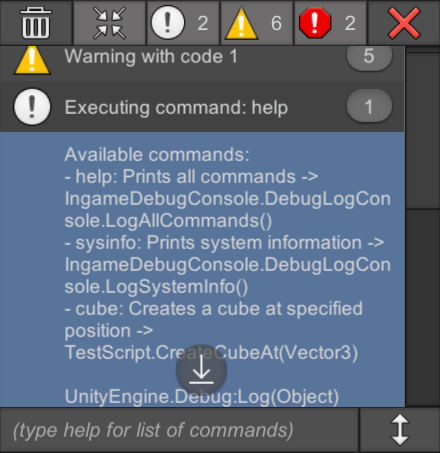

# In-game Debug Console for Unity 3D




**Available on Asset Store:** https://www.assetstore.unity3d.com/en/#!/content/68068

**Forum Thread:** http://forum.unity3d.com/threads/in-game-debug-console-with-ugui-free.411323/

## ABOUT

This asset helps you see debug messages (logs, warnings, errors, exceptions) runtime in a build (also assertions in editor) and execute commands using its built-in console. It also supports logging *logcat* messages to the console on Android platform.

User interface is created with **uGUI** and costs **1 SetPass call** (and 6 to 10 batches). It is possible to resize or hide the console window during the game. Once the console is hidden, a small popup will take its place (which can be dragged around). Console window will reappear after clicking the popup.


Console window is optimized using a customized recycled list view that calls *Instantiate* function sparingly. 

## HOW TO

Simply import **IngameDebugConsole.unitypackage** to your project and place **IngameDebugConsole** prefab to your scene. You may want to tweak the following settings:

- **Singleton**: if enabled, console window will persist between scenes (recommended). If, however, you don't want the console on each scene, then deselect this option and manually drag & drop the DebugLogCanvas prefab to the scenes you want
- **Clear Command After Execution**: if enabled, the command input field at the bottom of the console window will automatically be cleared after entering a command. If you want to spam a command, or make small tweaks to the previous command without having to write the whole command again, then deselect this option
- **Receive Logcat Logs In Android**: if enabled, on Android platform, logcat entries of the application will also be logged to the console with the prefix "*LOGCAT:*". This may come in handy especially if you want to access the native logs of your Android plugins (like *Admob*)
- **Logcat Arguments**: on Android, if Logcat logs are enabled, native logs will be filtered using these arguments. If left blank, all native logs of the application will be logged to the console. If you want to, for example, see Admob's logs only, you can enter **-s Ads** here

## COMMAND CONSOLE

### Executing Commands

You can enter commands using the input field at the bottom of the console. Initially, only "*help*" and "*sysinfo*" commands are available.

A command is basically a function that can be called from the console via the command input field. This function can be **static** or an **instance function** (non static), in which case, a living instance is required to call the function. The return type of the function can be anything (including *void*). If the function returns an object, it will be printed to the console. The function can also take any number of parameters; the only restriction applies to the types of these parameters. Supported parameter types are:

**Primitive types, string, Vector2, Vector3, Vector4, GameObject**

Note that *GameObject* parameters are assigned value using *GameObject.Find*.

To call a registered command, simply write down the command and then provide the necessary parameters. For example: 

`cube [0 2.5 0]`

To see the syntax of a command, see the help log:

`- cube: Creates a cube at specified position -> TestScript.CreateCubeAt(Vector3)`

Here, command is *cube* and the only necessary parameter is a *Vector3*. This command calls the *CreateCubeAt* function in the *TestScript* script (this demo script is not shipped with the asset).

Console uses a simple algorithm to parse the command input and has some restrictions:

- Don't put an f character after a float parameter
- Wrap strings with quotation marks ( " )
- Wrap vectors with brackets ( [] ) or parentheses ( () )

However, there is some flexibility in the syntax, as well:

- You can provide an empty vector to represent Vector_.zero: []
- You can enter 1 instead of true, or 0 instead of false

### Registering Custom Commands

If all the parameters of a function are of supported types, you can register the function to the console in three different ways:

- **ConsoleMethod Attribute**

Simply add **IngameDebugConsole.ConsoleMethod** attribute to your functions. These functions must be *public static* and must reside in a *public* class. These constraints do not apply to the other two methods.

```csharp
using UnityEngine;
using IngameDebugConsole;

public class TestScript : MonoBehaviour
{
	[ConsoleMethod( "cube", "Creates a cube at specified position" )]
	public static void CreateCubeAt( Vector3 position )
	{
		GameObject.CreatePrimitive( PrimitiveType.Cube ).transform.position = position;
	}
}
```

- **Static Functions**

Use `DebugLogConsole.AddCommandStatic( string command, string description, string methodName, System.Type ownerType )`. Here, **methodName** is the name of the method in string format, and **ownerType** is the type of the owner class. It may seem strange to provide the method name in string and/or provide the type of the class; however, after hours of research, I found it the best way to register any function with any number of parameters and parameter types into the system without knowing the signature of the method.

```csharp
using UnityEngine;
using IngameDebugConsole;

public class TestScript : MonoBehaviour
{
	void Start()
	{
		DebugLogConsole.AddCommandStatic( "cube", "Creates a cube at specified position", "CreateCubeAt", typeof( TestScript ) );
	}
	
	public static void CreateCubeAt( Vector3 position )
	{
		GameObject.CreatePrimitive( PrimitiveType.Cube ).transform.position = position;
	}
}
```

- **Instance Functions**

Use `DebugLogConsole.AddCommandInstance( string command, string description, string methodName, object instance )`:

```csharp
using UnityEngine;
using IngameDebugConsole;

public class TestScript : MonoBehaviour
{
	void Start()
	{
		DebugLogConsole.AddCommandInstance( "cube", "Creates a cube at specified position", "CreateCubeAt", this );
	}
	
	void CreateCubeAt( Vector3 position )
	{
		GameObject.CreatePrimitive( PrimitiveType.Cube ).transform.position = position;
	}
}
```

The only difference with *AddCommandStatic* is that, you have to provide an actual instance of the class that owns the function, instead of the type of the class.

To remove a command, use `DebugLogConsole.RemoveCommand( string command )`.
